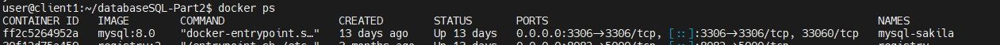
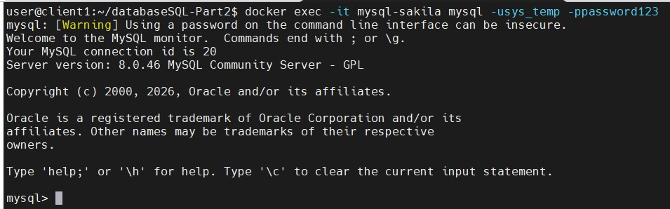
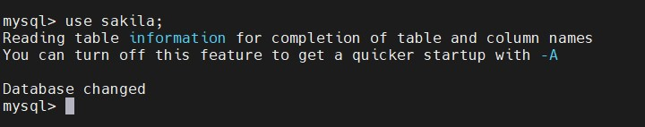
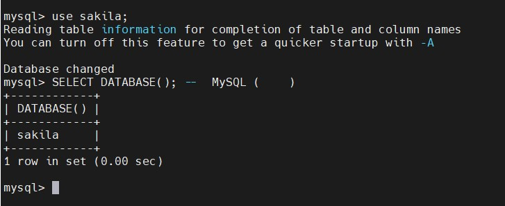
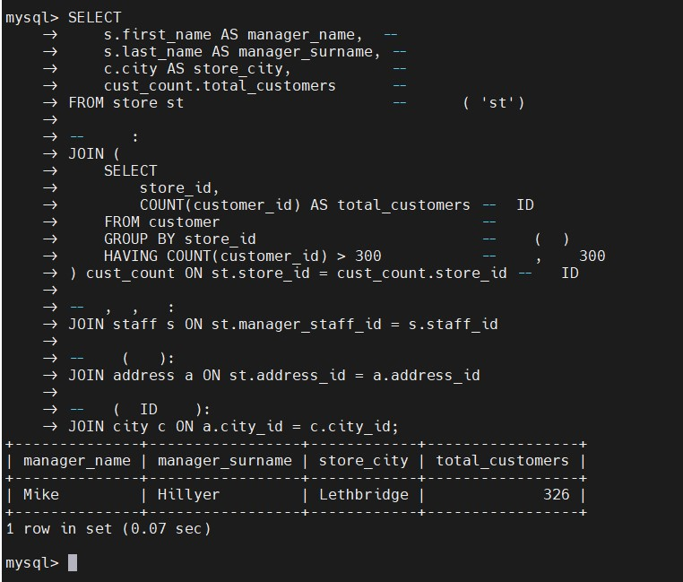
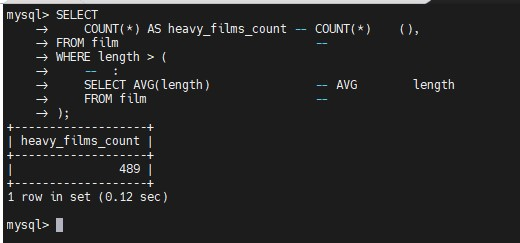
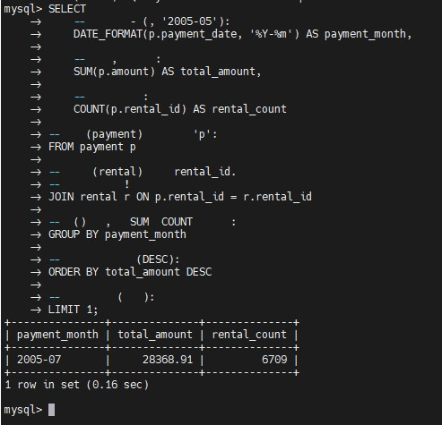
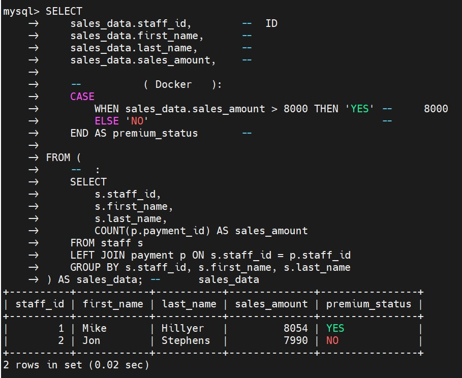

# Домашнее задание к занятию  «Работа с данными (DDL/DML)» - Бобков Александр
<details>
<summary><b>Задание 1.</b></summary>

1.1. Поднимите чистый инстанс MySQL версии 8.0+. Можно использовать локальный сервер или контейнер Docker.

1.2. Создайте учётную запись sys_temp. 

1.3. Выполните запрос на получение списка пользователей в базе данных. (скриншот)

1.4. Дайте все права для пользователя sys_temp. 

1.5. Выполните запрос на получение списка прав для пользователя sys_temp. (скриншот)

1.6. Переподключитесь к базе данных от имени sys_temp.

Для смены типа аутентификации с sha2 используйте запрос: 
```sql
ALTER USER 'sys_test'@'localhost' IDENTIFIED WITH mysql_native_password BY 'password';
```
1.6. По ссылке https://downloads.mysql.com/docs/sakila-db.zip скачайте дамп базы данных.

1.7. Восстановите дамп в базу данных.

1.8. При работе в IDE сформируйте ER-диаграмму получившейся базы данных. При работе в командной строке используйте команду для получения всех таблиц базы данных. (скриншот)

*Результатом работы должны быть скриншоты обозначенных заданий, а также простыня со всеми запросами.*


### ОТВЕТ:

---


### Шаг 1.1. Поднятие чистого инстанса MySQL 8.0+ через Docker

Для создания изолированной среды СУБД мы используем Docker, чтобы не засорять основную операционную систему лишними службами.

* **Инстанс (Instance)** — это запущенный в оперативной памяти компьютера и готовый к работе конкретный экземпляр программного обеспечения СУБД.

**Команда для терминала (ОС):**
```bash
docker run --name mysql-sakila -e MYSQL_ROOT_PASSWORD=root -p 3306:3306 -d mysql:8.0
```

- docker run — главная команда для скачивания и запуска нового контейнера
- --name mysql-sakila — задаем нашему контейнеру уникальное текстовое имя "mysql-sakila"
- -e MYSQL_ROOT_PASSWORD=root — выставляем переменную окружения (-e = environment), задавая пароль "root" для главного админа
- -p 3306:3306 — пробрасываем порты (-p = port). Левый 3306 — на моем ПК, правый 3306 — внутри контейнера. Теперь к базе можно подключиться с ПК
- -d — запускаем контейнер в фоновом режиме (-d = detached), чтобы консоль не заблокировалась и можно было писать команды дальше
- mysql:8.0 — указываю точную версию официального образа базы данных, которую нужно скачать с Docker Hub


---

### Шаг 1.2. Создание учётной записи sys_temp

Чтобы создать пользователя, нам нужно зайти внутрь запущенного контейнера под главным администратором.

**Команда для входа в консоль MySQL (Терминал ОС):**
```bash
docker exec -it mysql-sakila mysql -uroot -proot
```

- docker exec — команда для запуска процессов внутри уже работающего контейнера
- -it — интерактивный режим (-i = interactive, -t = tty), позволяющий нам вводить команды с клавиатуры и видеть текстовый ответ СУБД
- mysql-sakila — имя контейнера, внутрь которого мы заходим
- mysql — запускаем утилиту командной строки MySQL внутри контейнера
- -uroot — указываем пользователя (-u = user), под которым заходим: "root" (главный админ)
- -proot — указываем пароль (-p = password), который мы задали на Шаге 1.1: "root" (пишется слитно после флага -p)

- Команда `docker exec -it mysql-sakila mysql -uroot -proot` совмещает в себе два действия: она заходит внутрь контейнера и сразу же запускает консольный клиент СУБД `mysql`. Именно поэтому пользователь мгновенно видит приглашение к вводу `mysql>` вместо стандартной командной строки операционной системы Linux (которую можно вызвать отдельно с помощью команды `docker exec -it mysql-sakila bash`).


**SQL-запрос для создания пользователя (внутри консоли MySQL):**
```sql
CREATE USER 'sys_temp'@'%' IDENTIFIED BY 'password123';
```

- -- CREATE USER — зарезервированная команда SQL для регистрации новой учетной записи
- -- 'sys_temp' — имя нового пользователя (логин), которое мы придумываем
- -- '@'%' — хост, с которого разрешено подключаться. Знак процента % — это маска, означающая "разрешить подключение с любого компьютера или IP-адреса"
- -- IDENTIFIED BY — ключевые слова, после которых СУБД ожидает пароль для этого пользователя
- -- 'password123' — сам пароль в одинарных кавычках для нашей новой учетной записи sys_temp

---

### Шаг 1.3. Получение списка пользователей в базе данных

Убедимся, что учетная запись успешно создалась в системе, и подготовим первый скриншот.

**SQL-запрос:**
```sql
SELECT user, host, plugin FROM mysql.user;
```
- -- SELECT — главная команда SQL для чтения и вывода данных на экран
- -- user — имя столбца, где хранятся логины пользователей
- -- host — имя столбца, показывающего, с каких IP-адресов этим пользователям разрешен вход
- -- plugin — имя столбца, отражающего алгоритм шифрования пароля (например, caching_sha2_password или mysql_native_password)
- -- FROM — ключевое слово, указывающее, откуда именно мы берем эти столбцы
- -- mysql.user — системная таблица с именем "user", которая лежит внутри служебной базы данных с именем "mysql"
<details>

<summary><b>Пометка для себя.</b></summary>

- Откуда берется системная таблица `mysql.user`?
    Эта таблица **появляется автоматически** в момент самой первой инициализации СУБД. 
    Когда вы запускаете чистый контейнер Docker, сервер MySQL сам создает служебные базы данных и таблицы для своих внутренних нужд.

- Что означает точка в записи `mysql.user`?
    Точка в базах данных выполняет роль разделителя путей (как «Папка.Файл»):
    **`mysql`** (до точки) — это название встроенной, служебной **базы данных** (схемы), которая является «паспортным столом» СУБД.
    **`user`** (после точки) — это конкретная **таблица** внутри этой базы, где хранятся логины, хэши паролей и глобальные права всех аккаунтов.
    Удалять эту таблицу категорически нельзя, иначе СУБД перестанет работать.
</details>

> **📸 Скриншот списка пользователей:**

<details>
<summary><b>Расшифровка скриншота списка пользователей.</b></summary>

* **`sys_temp | % | caching_sha2_password`** Наша новая учетная запись, созданная на Шаге 1.2. Логин — `sys_temp`. Хост `%` подтверждает, что заходить пользователю можно с любого IP-адреса. Плагин `caching_sha2_password` — это современный алгоритм безопасного шифрования паролей, используемый по умолчанию в MySQL 8.0.
* **`root | %`** и **`root | localhost`** Это две разные записи для главного администратора (`root`). Запись со знаком `%` позволяет администратору подключаться удаленно (например, через графические программы с основного компьютера), а запись с хостом `localhost` разрешает вход только локально (прямо из консоли самого контейнера Docker).
* **`mysql.infoschema`**, **`mysql.session`**, **`mysql.sys`** Это встроенные **системные (технические) аккаунты**. Они закладываются разработчиками MySQL в момент установки. СУБД использует их самостоятельно: `mysql.sys` нужен для работы встроенных диагностических представлений, `mysql.session` — для плагинов и внутренних сессий сервера, а `mysql.infoschema` — для автоматического сбора метаданных о структуре ваших таблиц. Человеку под ними авторизоваться не нужно.

</details>

> **📸 Скриншот текущих прав созданного пользователя:**


<details>
<summary><b>Расшифровка скриншота текущих  прав созданного пользователя.</b></summary>

* **`GRANT USAGE`** — слово `USAGE` переводится как *«использование»*. В MySQL это кодовое обозначение **«абсолютно пустых прав»**. Сервер сообщает: *«Я знаю этот логин и пароль, я разрешаю пользователю успешно войти в систему. Но ему запрещено читать, изменять или создавать любые таблицы»*. Это базовое состояние только что созданного аккаунта.
* **`ON *.*`** — зона действия правила. Символ `*` (звёздочка) означает «всё», а точка разделяет базы данных и таблицы (`База.Таблица`). Первая звёздочка — это **все базы данных**, вторая — **все таблицы**. Вместе `*.*` означает, что техническое право на вход применяется глобально ко всему серверу.
* **`TO 'sys_temp'@'%'`** — указывает получателя. `TO` — «для» пользователя `sys_temp`. Знак `@` — разделитель «с хоста». Знак `%` — маска, означающая **«любой IP-адрес в мире»**. То есть пользователю разрешено подключаться с любого компьютера.
* **`1 row in set (0.00 sec)`** — служебная строка. Переводится как *«1 строка в наборе данных»*. База данных нашла ровно одно стартовое правило для этого аккаунта и вывела его на экран за `0.00` секунд (мгновенно).

</details>
---

### Шаг 1.4. Предоставление всех прав пользователю sys_temp

По умолчанию новый пользователь пустой и не видит никаких данных. Нам нужно наделить его правами администратора.

**SQL-запросы:**
```sql
GRANT ALL PRIVILEGES ON *.* TO 'sys_temp'@'%' WITH GRANT OPTION;
```

- -- GRANT ALL PRIVILEGES — команда, которая передает абсолютно все доступные права (чтение, запись, удаление таблиц, создание баз)
- -- ON *.* — зона действия прав. Первая звездочка означает "все базы данных", вторая звездочка после точки — "все таблицы внутри этих баз"
- -- TO 'sys_temp'@'%' — указывает конкретного пользователя и его хост, которому мы эти права вручаем
- -- WITH GRANT OPTION — специальное право, позволяющее пользователю sys_temp в будущем самому выдавать права другим аккаунтам

```sql
FLUSH PRIVILEGES;
```
- -- FLUSH PRIVILEGES — команда, которая принудительно очищает кэш прав в оперативной памяти и загружает новые правила с диска. 
- -- Без неё MySQL может "не заметить" выданные права до полной перезагрузки сервера

---

### Шаг 1.5. Получение списка прав для пользователя sys_temp

Проверим, зафиксировались ли максимальные права за пользователем `sys_temp`.

**SQL-запрос:**
```sql
SHOW GRANTS FOR 'sys_temp'@'%';
```

- -- SHOW GRANTS FOR — специальная сервисная команда для вывода списка всех действующих разрешений и привилегий
- -- 'sys_temp'@'%' — указываем конкретного пользователя и хост, чьи права мы хотим проинспектировать

> **📸 Скриншот измененных прав созданного пользователя:**


<details>
<summary><b>Расшифровка скриншота измененных  прав созданного пользователя.</b></summary>

* **Классические привилегии**: (`SELECT`, `INSERT`, `DROP` и др. на `*.*`), позволяющие управлять данными.
* **Динамические привилегии MySQL 8.0+**: Системные права (`BACKUP_ADMIN`, `ROLE_ADMIN` и др.).
* **`WITH GRANT OPTION`**: Право пользователя `sys_temp` передавать свои права другим.
</details>


---

### Шаг 1.6. Смена типа аутентификации и переподключение

В MySQL 8 по умолчанию включен сложный тип шифрования паролей, из-за которого старые утилиты или IDE могут выдавать ошибку. Переключим пользователя на классический и самый совместимый режим, после чего зайдем под его именем.

**SQL-запросы для смены типа шифрования:**
```sql
ALTER USER 'sys_temp'@'%' IDENTIFIED WITH mysql_native_password BY 'password123';
```

- -- ALTER USER — команда для изменения параметров уже существующего в системе пользователя
- -- 'sys_temp'@'%' — указываем, какого именно пользователя мы редактируем
- -- IDENTIFIED WITH mysql_native_password — меняем плагин шифрования на старый стандарт (mysql_native_password), его понимают 100% программ
- -- BY 'password123' — повторно прописываем пароль для этого типа шифрования (пароль остается прежним)

```sql
FLUSH PRIVILEGES;
```
- -- Повторно обновляем кэш прав в оперативной памяти сервера для применения настроек безопасности

**Команды для переподключения:**
```sql
EXIT;
```
- -- EXIT; — встроенная команда MySQL, которая закрывает текущую сессию и выводит нас обратно в консоль операционной системы

```bash
docker exec -it mysql-sakila mysql -usys_temp -ppassword123
```

-  docker exec -it — снова подключаемся к контейнеру в интерактивном режиме клавиатуры
-  mysql-sakila — имя нашего контейнера
-  mysql — запускаем клиент базы данных
-  -usys_temp — флаг пользователя (-u), заходим под созданным "sys_temp" (пишется слитно)
-  -ppassword123 — флаг пароля (-p), вводим пароль "password123" (пишется слитно без пробелов)

---

### Шаг 1.7. Скачивание и восстановление дампа Sakila DB

Дамп — это текстовый файл, в котором написан SQL-код для автоматического создания таблиц и их заполнения. Нам нужно закинуть эти файлы с компьютера внутрь контейнера и запустить.

* **Дамп (Dump)** — это файл резервной копии, содержащий в себе чистый SQL-код (`CREATE TABLE`, `INSERT INTO`) для полного воссоздания структуры и наполнения базы данных на любом другом компьютере. Использованный в работе дамп Sakila DB — это официальная демонстрационная база данных, выгруженная разработчиками MySQL в текстовые файлы для учебных целей.

**Команды для терминала ОС (копирование файлов внутрь контейнера):**
```bash
docker cp /путь_к_папке/sakila-schema.sql mysql-sakila:/tmp/sakila-schema.sql
```
- docker cp — команда копирования файлов (cp = copy) между вашим компьютером и контейнером Docker
- /путь_к_папке/sakila-schema.sql — точный путь, где лежит файл структуры на вашем жестком диске
- mysql-sakila:/tmp/sakila-schema.sql — имя контейнера, двоеточие и папка внутри контейнера (/tmp/), куда мы копируем этот файл

### Точно так же копируем второй файл, который содержит готовые данные для таблиц (строки, имена, даты)
```bash
docker cp /путь_к_папке/sakila-data.sql mysql-sakila:/tmp/sakila-data.sql
```

**Команды для применения дампов (в окне где открыта консоль MySQL `mysql>`):**
```sql
SOURCE /tmp/sakila-schema.sql;
```
- -- SOURCE — внутренняя команда MySQL, которая открывает текстовый файл по указанному пути и выполняет каждую строчку кода из него
- -- /tmp/sakila-schema.sql — путь внутри контейнера до файла схемы. Запрос создаст базу данных 'sakila' и пустые таблицы в ней

```sql
SOURCE /tmp/sakila-data.sql;
```
- -- Применяем второй файл. Запрос прочитает строки и наполнит созданные пустые таблицы демонстрационными данными

> **📸 Скриншот копирования дампов:**



---

### Шаг 1.8. Получение результирующей структуры базы данных

Переключаемся на созданную базу и смотрим, какие таблицы появились.

**SQL-запросы:**
```sql
SHOW TABLES;
```
- -- USE — команда переключения контекста работы. Мы говорим серверу: "все следующие запросы выполняй внутри базы данных sakila"
USE sakila;

- -- SHOW TABLES — сервисная команда, которая ищет в текущей активной базе все таблицы и выводит их красивым списком на экран


> **📸 Скриншот просмотра таблицы базы sakila:**


---
<details>
<summary><b>Итоговая "Простыня".</b></summary>


```sql

-- [КОНСОЛЬ ОС]: docker run — запуск чистого фонового (-d) контейнера СУБД версии 8.0 с портом 3306 и паролем root для админа
-- docker run --name mysql-sakila -e MYSQL_ROOT_PASSWORD=root -p 3306:3306 -d mysql:8.0

-- [КОНСОЛЬ ОС]: docker exec -it — интерактивный вход в консоль контейнера под пользователем (-u) root и паролем (-p) root
-- docker exec -it mysql-sakila mysql -uroot -proot


-- [Пункт 1.2]: CREATE USER — создание новой учетной записи 'sys_temp'. 
-- Маска '@"%"' разрешает пользователю подключаться с любых компьютеров и IP-адресов. Пароль — 'password123'
CREATE USER 'sys_temp'@'%' IDENTIFIED BY 'password123';


-- [Пункт 1.3]: SELECT ... FROM mysql.user — чтение системной таблицы со списком всех пользователей СУБД.
-- Выводим столбцы user (логин), host (адрес доступа) и plugin (метод шифрования). 
-- (К этому шагу прилагается Скриншот)
SELECT user, host, plugin FROM mysql.user;


-- [Пункт 1.4]: GRANT ALL PRIVILEGES — выдача максимальных прав администратора на все базы данных и все таблицы (*.*)
-- пользователю 'sys_temp'@'%'. Параметр WITH GRANT OPTION разрешает ему делегировать свои права другим аккаунтам.
GRANT ALL PRIVILEGES ON *.* TO 'sys_temp'@'%' WITH GRANT OPTION;

-- FLUSH PRIVILEGES — принудительный сброс кэша прав в оперативной памяти сервера для мгновенного применения новых доступов
FLUSH PRIVILEGES;


-- [Пункт 1.5]: SHOW GRANTS FOR — вызов системного лога привилегий для проверки и подтверждения выданных прав пользователю sys_temp.
-- (К этому шагу прилагается Скриншот)
SHOW GRANTS FOR 'sys_temp'@'%';


-- [Пункт 1.6]: ALTER USER ... IDENTIFIED WITH mysql_native_password — изменение плагина шифрования на классический
-- для обеспечения совместимости со старыми консольными клиентами и сторонними графическими IDE. Пароль подтверждаем старый.
ALTER USER 'sys_temp'@'%' IDENTIFIED WITH mysql_native_password BY 'password123';

-- Повторная синхронизация и обновление матриц прав доступа в памяти MySQL
FLUSH PRIVILEGES;


-- [КОНСОЛЬ MySQL]: EXIT; — разрыв текущей сессии администратора root и выход в терминал операционной системы компьютера
-- EXIT;


-- [КОНСОЛЬ ОС]: docker cp — копирование скачанных файлов дампа (схемы и данных) с жесткого диска ПК внутрь папки /tmp/ контейнера Docker
-- docker cp /путь_к_файлу/sakila-schema.sql mysql-sakila:/tmp/sakila-schema.sql
-- docker cp /путь_к_файлу/sakila-data.sql mysql-sakila:/tmp/sakila-data.sql

-- [КОНСОЛЬ ОС]: docker exec -it — повторная авторизация в консоли MySQL, но уже под созданным пользователем sys_temp и его паролем
-- docker exec -it mysql-sakila mysql -usys_temp -ppassword123


-- [КОНСОЛЬ MySQL]: SOURCE — последовательное чтение и выполнение SQL-инструкций из файлов дампов.
-- Первая команда создает структуру таблиц, вторая — наполняет таблицы строками данных.
-- SOURCE /tmp/sakila-schema.sql;
-- SOURCE /tmp/sakila-data.sql;


-- [Пункт 1.8]: USE sakila — переключение контекста работы сессии на созданную базу данных 'sakila'.
USE sakila;

-- SHOW TABLES — вывод финального перечня всех успешно созданных и импортированных таблиц базы данных Sakila.
-- (К этому шагу прилагается Скриншот)
SHOW TABLES;

```
</details>

</details>

------
------


<details>
<summary><b>Задание 2.</b></summary>

Составьте таблицу, используя любой текстовый редактор или Excel, в которой должно быть два столбца: в первом должны быть названия таблиц восстановленной базы, во втором названия первичных ключей этих таблиц. Пример: (скриншот/текст)
```
Название таблицы | Название первичного ключа
customer         | customer_id
```
------

### ОТВЕТ:


- У каждой таблицы в базе данных есть свой главный (первичный) ключ. Это колонка с уникальным номером, который никогда не повторяется. 
---

- Требуемую таблицу из задания  можно составить двумя способами: автоматически (через быстрый запрос) и вручную.

### Способ 1. Автоматический (через системный SQL-запрос)
Чтобы не проверять все таблицы глазами, мы пишем запрос к системной «амбарной книге» метаданных СУБД — таблице `KEY_COLUMN_USAGE` внутри служебной базы `information_schema`.

**SQL-запрос и разбор его логики простыми словами:**
```sql
SELECT 
    TABLE_NAME AS 'Nazvanie tablici',         -- Из найденных строк берем имя таблицы и переименовываем для красоты на русский язык
    COLUMN_NAME AS 'Nazvanie pervichnih kluchei' -- Берем имя колонки-ключа и переименовываем
FROM 
    information_schema.KEY_COLUMN_USAGE      -- Просим сервер заглянуть в системный справочник, куда он сам записывает все ключи
WHERE 
    TABLE_SCHEMA = 'sakila'                  -- Фильтр 1: Искать ключи только внутри нашей новой базы данных 'sakila'
    AND CONSTRAINT_NAME = 'PRIMARY';          -- Фильтр 2: Оставить только первичные ключи (игнорируя обычные и внешние связи)
```

**Итоговая таблица первичных ключей Sakila DB:**
> **📸 Скриншот просмотра таблицы первичных ключей через запрос:**



---

### Способ 2. Вручную 
Нужно самостоятельно заглянуть внутрь каждой таблицы с помощью команды инспекции **`DESCRIBE`** (описать).

**Пример ручной проверки таблицы магазинов:**
```sql
DESCRIBE store;
```

**Разбор полученного ответа **
После ввода команды на экран выводится техническая структура таблицы:

> **📸 Скриншот просмотра технической структуры таблицы:**



Чтобы составить итоговую таблицу вручную, нужно смотреть колонку **`Key`** (ключ) и анализировать её маркеры:
* **`PRI` (PRIMARY KEY — Первичный ключ)**: Искомый маркер. Он горит напротив поля `store_id`. Это главный уникальный идентификатор строки, который мы вручную переносим в итоговую таблицу.
* **`UNI` (UNIQUE KEY — Уникальный индекс)**: Горит напротив `manager_staff_id`. Он означает, что в этой колонке запрещены дубликаты (один сотрудник может быть менеджером строго одного конкретного магазина).
* **`MUL` (MULTIPLE INDEX — Внешний ключ / Foreign Key)**: Горит напротив `address_id`. Он указывает на связь этой таблицы со справочником физических адресов.

Поочередно проверяя таблицы через `DESCRIBE имя_таблицы;`, мы соберем точно такой же список первичных ключей, который автоматически сформировал наш SQL-скрипт в Способе 1. В таблицах `film_actor` и `film_category` маркер `PRI` загорится сразу в двух колонок — это означает составной первичный ключ.


</details>

-------
-------

<details>
<summary><b>Задание 3*.</b></summary>
3.1. Уберите у пользователя sys_temp права на внесение, изменение и удаление данных из базы sakila.

3.2. Выполните запрос на получение списка прав для пользователя sys_temp. (скриншот)

*Результатом работы должны быть скриншоты обозначенных заданий, а также простыня со всеми запросами.*

-------

### ОТВЕТ:

При попытке точечно забрать права `INSERT, UPDATE, DELETE` у глобального пользователя СУБД выдает ошибку `ERROR 1141 (42000): There is no such grant defined`. Это происходит потому, что в MySQL нельзя частично урезать глобальные права `*.*` на уровне одной конкретной базы данных без включения системной переменной `partial_revokes`.
- Пояснение почему не получилось точечно:
1. Ранее  я выдал пользователю права глобально на **весь** сервер сразу через команду `*.*`.
2. В MySQL права работают по уровням (как этажи в здании): есть глобальный уровень (весь сервер `*.*`), а есть локальный (конкретная база `sakila.*`). 
3. Когда мы пишем команду `REVOKE ... ON sakila.*`, сервер MySQL спускается на локальный уровень базы `sakila` и пытается найти там выданные ранее права, чтобы их забрать. Но там пусто! Все права лежат «этажом выше» — на глобальном уровне `*.*`.
4. MySQL говорит: *«Я не могу забрать у пользователя права на базу sakila, потому что я никогда не выдавал их конкретно для базы sakila. Они выданы для всего сервера вообще!»*.

**Алгоритм верного решения (выполняется под администратором root):**
```sql
REVOKE ALL PRIVILEGES, GRANT OPTION FROM 'sys_temp'@'%';
```
- --Полностью сбрасываем старые глобальные права пользователя

```sql
GRANT CREATE, DROP, ALTER, REFERENCES, INDEX, CREATE TEMPORARY TABLES, LOCK TABLES, CREATE VIEW, SHOW VIEW, EXECUTE ON *.* TO 'sys_temp'@'%' WITH GRANT OPTION;
```
- --Переназначаем права точечно: даем глобальное право на создание структур

```sql
GRANT SELECT ON sakila.* TO 'sys_temp'@'%';
```
- --На целевую базу данных sakila выдаем СТРОГО только право чтения данных (SELECT)

```sql
FLUSH PRIVILEGES;

```
- --Фиксируем настройки в памяти сервера

```sql
SHOW GRANTS FOR 'sys_temp'@'%';
```
- --Запускаем проверку прав для скриншота

**Скриншот прав доступа:**



<details>
<summary><b>Расшифровка скриншота .</b></summary>


После того как перенастроили безопасность, команда `SHOW GRANTS` вывела на экран две строки. :

1. **`GRANT CREATE, DROP, REFERENCES, INDEX, ALTER, CREATE TEMPORARY TABLES, LOCK TABLES, EXECUTE, CREATE VIEW, SHOW VIEW ON *.* TO 'sys_temp'@'%' WITH GRANT OPTION`**
   * **Что это значит**: Это правила на глобальном уровне (для всего сервера `*.*`). Оставили пользователю право создавать новые таблицы (`CREATE`), удалять их (`DROP`), изменять их структуру (`ALTER`) и настраивать связи (`REFERENCES`). 
   * **Самое главное**: Посмотрите внимательно на этот список — из него **полностью исчезли слова `INSERT`, `UPDATE` и `DELETE`**. Это значит, что у пользователя больше нет автоматического глобального права менять строки внутри таблиц.

2. **`GRANT SELECT ON sakila.* TO 'sys_temp'@'%'`**
   * **Что это значит**: Это специальное точечное правило, которое создано строго для базы данных Sakila (`sakila.*`). 
   * **Самое главное**: Слово **`SELECT`** переводится как *«выбрать/прочитать»*. Эта строка жестко приказывает серверу: *«Внутри базы данных Sakila этому пользователю разрешено только смотреть и читать данные»*. 


</details>


<details>
<summary><b>"Портянка"</b></summary>

- --Сброс и точечное переназначение прав для блокировки INSERT, UPDATE, DELETE в sakila
REVOKE ALL PRIVILEGES, GRANT OPTION FROM 'sys_temp'@'%';
GRANT CREATE, DROP, ALTER, REFERENCES, INDEX, CREATE TEMPORARY TABLES, LOCK TABLES, CREATE VIEW, SHOW VIEW, EXECUTE ON *.* TO 'sys_temp'@'%' WITH GRANT OPTION;
GRANT SELECT ON sakila.* TO 'sys_temp'@'%';
FLUSH PRIVILEGES;

- --Финальная проверка урезанных прав пользователя
SHOW GRANTS FOR 'sys_temp'@'%';

</details>


</details>

------
------

