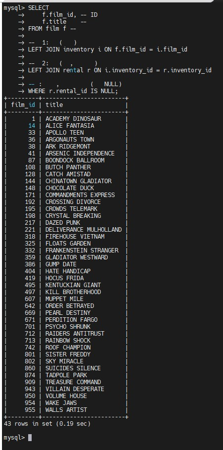

# Домашнее задание к занятию  «Работа с данными (DDL/DML)» - Бобков Александр
<details>
<summary><b>Задание 1.</b></summary>

Одним запросом получите информацию о магазине, в котором обслуживается более 300 покупателей, и выведите в результат следующую информацию: 

- фамилия и имя сотрудника из этого магазина;
- город нахождения магазина;
- количество пользователей, закреплённых в этом магазине.

## ОТВЕТ:

### 1. Смотри запущен ли контейнер из предыдущего задание с базой sakila

```bash
docker ps
```

> **📸 Скриншот просмотра запущенного контейнера с базой:**


### 2. Подключаемся к развернутой базе внутри контейнера:

```bash
docker exec -it mysql-sakila mysql -usys_temp -ppassword123
```
> **📸 Скриншот подключения к MySQL:**


### 3. Проваливаемся внутрь базы данных sakila:

```sql
USE sakila;
```
> **📸 Скриншот подключения к базе sakila:**


- Проверяем, что точно провалились внутрь нашей базы sakila:

```sql
SELECT DATABASE();
```
> **📸 Скриншот что мы в базе sakila:**


### 4. Выполняем следующий запрос в базе:

```sql
SELECT 
    s.first_name AS manager_name,  -- Выбираем имя сотрудника
    s.last_name AS manager_surname, -- Выбираем фамилию сотрудника
    c.city AS store_city,           -- Выбираем название города
    cust_count.total_customers      -- Выбираем наше посчитанное количество клиентов
FROM store st                       -- Начинаем с главной таблицы магазинов (сокращенно 'st')

-- Подключаем временный результат подсчета клиентов:
JOIN (
    SELECT 
        store_id, 
        COUNT(customer_id) AS total_customers -- Считаем ID клиентов
    FROM customer                             -- Из таблицы клиентов
    GROUP BY store_id                         -- Группируем по магазинам (для каждого отдельно)
    HAVING COUNT(customer_id) > 300           -- Оставляем только те группы, где клиентов больше 300
) cust_count ON st.store_id = cust_count.store_id -- Соединяем по ID магазина

-- Подключаем сотрудников, чтобы узнать, кто управляет магазином:
JOIN staff s ON st.manager_staff_id = s.staff_id

-- Подключаем адреса магазинов (чтобы выйти на город):
JOIN address a ON st.address_id = a.address_id

-- Подключаем города (связываем по ID города из таблицы адресов):
JOIN city c ON a.city_id = c.city_id;

```

> **📸 Скриншот отработки запроса с необходимым выводом по заданию:**


</details>

</details>

------
------


<details>
<summary><b>Задание 2.</b></summary>
Получите количество фильмов, продолжительность которых больше средней продолжительности всех фильмов.

------

## ОТВЕТ:

### 1. Выполняем следующий запрос в базе:

```sql
SELECT 
    COUNT(*) AS heavy_films_count -- COUNT(*) считает количество строк (фильмов), прошедших фильтр
FROM film                            -- Ищем в таблице фильмов
WHERE length > (
    -- Вложенный подзапрос:
    SELECT AVG(length)               -- AVG находит среднее арифметическое всех значений в колонке length
    FROM film                        -- Считаем по всей таблице фильмов
);

```
> **📸 Скриншот отработки запроса с необходимым выводом по заданию:**


</details>

-------
-------

<details>
<summary><b>Задание 3.</b></summary>

Получите информацию, за какой месяц была получена наибольшая сумма платежей, и добавьте информацию по количеству аренд за этот месяц.


-------

## ОТВЕТ:

Логика работы:
- Мы соединяем таблицы оплат (payment) и аренд (rental) по общему признаку — месяцу и году. Затем группируем все данные по месяцам, складываем деньги (SUM), считаем аренды (COUNT) и сортируем от самых больших денег к самым маленьким. С помощью LIMIT 1 забираем верхнюю строчку.

### 1. Выполняем следующий запрос в базе:

```sql
SELECT 
    sales_data.staff_id,        -- Выводим ID сотрудника из подготовленных данных
    sales_data.first_name,      -- Выводим имя сотрудника
    sales_data.last_name,       -- Выводим фамилию сотрудника
    sales_data.sales_amount,    -- Выводим точное посчитанное число его продаж
    
    -- Проверяем готовое число продаж и выводим статус:
    CASE 
        WHEN sales_data.sales_amount > 8000 THEN 'YES' -- Если продаж строго больше 8000
        ELSE 'NO'                                      -- Во всех остальных случаях
    END AS premium_status       -- Название для нашей колонки с премией
    
FROM (
    -- Внутренний конвейер: сначала просто считаем продажи для каждого сотрудника
    SELECT 
        s.staff_id, 
        s.first_name, 
        s.last_name, 
        COUNT(p.payment_id) AS sales_amount
    FROM staff s
    LEFT JOIN payment p ON s.staff_id = p.staff_id
    GROUP BY s.staff_id, s.first_name, s.last_name
) AS sales_data; -- Даем этой временной таблице имя sales_data

```

> **📸 Скриншот отработки запроса с необходимым выводом по заданию:**


</details>

-------
-------

<details>
<summary><b>Задание 4*</b></summary>
Посчитайте количество продаж, выполненных каждым продавцом. Добавьте вычисляемую колонку «Премия». Если количество продаж превышает 8000, то значение в колонке будет «Да», иначе должно быть значение «Нет».

-----

## ОТВЕТ:

Логика работы:
Считаем количество оформленных платежей для каждого сотрудника. Конструкция CASE WHEN проверяет логическое условие: если количество строк-продаж превысило 8000, в созданную нами колонку bonus выводится текст 'Да', иначе — 'Нет'. Мы используем LEFT JOIN, чтобы сотрудники не исчезли, если у них вдруг будет 0 продаж.

### 1. Выполняем следующий запрос в базе:

```sql
SELECT 
    s.staff_id,                          -- Выводим ID сотрудника
    s.first_name,                        -- Выводим имя
    s.last_name,                         -- Выводим фамилию
    COUNT(p.payment_id) AS sales_amount, -- Считаем количество строк-оплат для этого продавца
    
    -- Создаем умную вычисляемую колонку:
    CASE 
        WHEN COUNT(p.payment_id) > 8000 THEN 'Да' -- ЕСЛИ насчитали больше 8000 продаж, то пишем 'Да'
        ELSE 'Нет'                                -- ИНАЧЕ (если меньше или равно) пишем 'Нет'
    END AS premium_status                     -- Задаем имя этой новой колонке
    
FROM staff s                             -- Берем таблицу персонала

-- LEFT JOIN гарантирует: мы увидим сотрудника, даже если у него вообще нет продаж:
LEFT JOIN payment p ON s.staff_id = p.staff_id

GROUP BY s.staff_id, s.first_name, s.last_name; -- Группируем по сотрудникам, чтобы подсчет шел для каждого человека отдельно
```

> **📸 Скриншот отработки запроса с необходимым выводом по заданию:**


</details>

-------
-------

<details>
<summary><b>Задание 5*</b></summary>

Найдите фильмы, которые ни разу не брали в аренду.

-------

## ОТВЕТ:

Логика работы: Мы соединяем весь каталог фильмов с инвентарем магазина и записями об арендах с помощью LEFT JOIN. Если фильм ни разу не брали, то на месте данных об аренде останется пустота (NULL). Мы фильтруем строки и выводим только такие «забытые» фильмы.

### 1. Выполняем следующий запрос в базе: 

```sql
SELECT 
    f.film_id, -- ID фильма
    f.title    -- Название фильма
FROM film f -- Берем главный список всех фильмов из каталога

-- Шаг 1: Привязываем инвентарь (физические диски в магазинах)
LEFT JOIN inventory i ON f.film_id = i.film_id

-- Шаг 2: Привязываем аренду (записи о том, кто и когда брал эти диски)
LEFT JOIN rental r ON i.inventory_id = r.inventory_id

-- Фильтр: оставляем только те фильмы, для которых в таблице аренды не нашлось записей (значение пустое — NULL)
WHERE r.rental_id IS NULL;
```
> **📸 Скриншот отработки запроса с необходимым выводом по заданию:**


</details>


</details>

------
------

